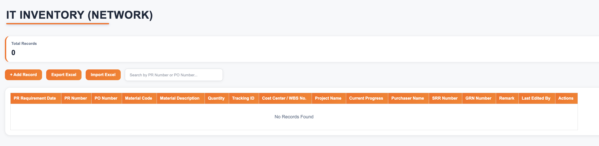
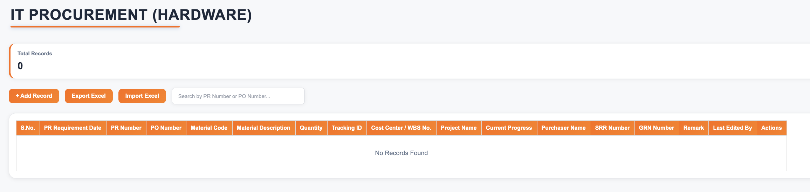
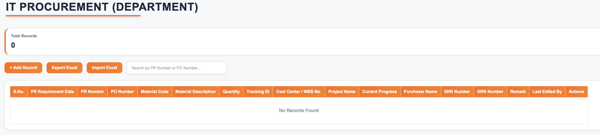
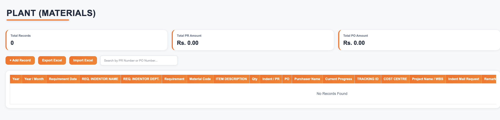
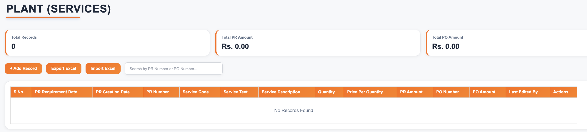

# 🚀 AI-Enabled Procurement & Asset Management System

> A comprehensive Full-Stack Procurement & Asset Management System built using **Node.js**, **Express.js**, **MongoDB**, **HTML**, **CSS**, and **JavaScript**, designed to digitize procurement workflows, inventory management, plant operations, and project budget tracking. The system also integrates **Google Gemini AI** to generate professional procurement-related emails, reducing manual effort and improving communication.

---


---

# 📌 Overview

The **AI-Enabled Procurement & Asset Management System** is a centralized enterprise web application developed to streamline procurement activities, contract management, inventory tracking, plant operations, and project budget monitoring within an organization.

The application replaces manual spreadsheets and paperwork with a secure digital platform offering:

- Secure Authentication
- Role-Based Access Control (RBAC)
- Dynamic Module Permissions
- Dashboard Analytics
- AI-Powered Email Generation
- Excel Import & Export
- PDF Document Management
- Complete CRUD Operations
- Search & Filtering
- Responsive User Interface

The project follows a modular architecture, allowing different departments to access only the modules and operations permitted to them.

---

# ✨ Features

## 🔐 Authentication & User Management

- Secure Login System
- Password Encryption using bcrypt
- Role-Based Access Control (RBAC)
- Dynamic Permission Management
- User Profile Management
- Change Password
- Session Management
- Email Notifications

---

## 🤖 AI Features

- AI-Powered Procurement Email Assistant
- Professional Email Draft Generation
- Context-Aware Email Suggestions
- One-Click Email Content Generation
- Google Gemini API Integration
- Reduces Manual Email Writing
- Improves Communication Consistency

---

## 📦 Procurement Management

### 🌐 Network & Bandwidth Management

- Vendor Management
- Purchase Order Tracking
- Invoice Tracking
- Contract Period Management
- Balance Amount Calculation
- PDF Document Upload
- Excel Import & Export
- Search & Filtering
- Complete CRUD Operations
- AI-Assisted Email Generation

---

### 🛠 Annual Maintenance Contract (AMC)

- AMC Record Management
- Vendor Information
- Contract Duration
- Invoice Tracking
- Purchase Orders
- PDF Upload
- Excel Import & Export
- CRUD Operations
- AI Email Assistant

---

### 📋 Contract Resource & Support PRs

- Resource Procurement Records
- Purchase Request Tracking
- Purchase Orders
- Invoice Management
- Document Upload
- Excel Import & Export
- Search Records
- CRUD Operations
- AI Email Generation


## 💻 IT Procurement

### 🌐 Network Inventory

- Network Equipment Tracking
- Vendor Management
- Purchase Order Management
- Invoice Management
- Document Upload
- Excel Import & Export
- Search & Filtering
- CRUD Operations

---

### 🖥️ Hardware Inventory

- Hardware Asset Management
- Vendor Details
- Purchase Orders
- Invoice Tracking
- PDF Document Upload
- Excel Import & Export
- CRUD Operations

---

### 🏢 IT Department Indent

- Department Purchase Requests
- Material Tracking
- Purchase Order Status
- Document Management
- Excel Import & Export
- Search Records
- CRUD Operations

---

## 🏭 Plant Management

### 📦 Plant Material Management

- Plant Material Records
- Material Code Management
- Requirement Tracking
- Purchase Order Tracking
- Material Delivery Status
- Material Receipt Status
- SRR Clearance Tracking
- Project/WBS Mapping
- Excel Import & Export
- CRUD Operations

---

### 🔧 Plant Service Management

- Service Request Management
- Service Code Tracking
- Service Description
- Quantity & Pricing
- PR Amount Calculation
- PO Amount Tracking
- Excel Import & Export
- CRUD Operations

---

## 📁 WBS Project Management

- WBS Number Management
- Project Description
- Budget Allocation
- Actual Expense Tracking
- Budget Availability Monitoring
- Commitment Tracking
- Transfer Details
- Released Budget Tracking
- Excel Import & Export
- CRUD Operations

---

## 📊 Dashboard & Analytics

- Interactive Dashboard
- Real-Time Statistics
- Procurement Summary
- Budget Overview
- Record Counters
- Dynamic Charts
- Module-wise Navigation
- Responsive Dashboard Layout

---

## ⚙ Additional Features

- Secure Authentication
- Dynamic Sidebar
- Role-Based Permissions
- Search Functionality
- Excel Import
- Excel Export
- PDF Upload
- CRUD Operations
- Toast Notifications
- Confirmation Dialogs
- Responsive UI
- User Profile Management
- Change Password
- Last Edited By Tracking

---

# 🛠 Tech Stack

## Frontend

- HTML5
- CSS3
- JavaScript (ES6)

---

## Backend

- Node.js
- Express.js

---

## Database

- MongoDB Atlas
- Mongoose ODM

---

## AI Integration

- Google Gemini API

---

## Libraries & Packages

- bcryptjs
- multer
- xlsx
- nodemailer
- dotenv
- cors
- mongoose
- chart.js
- google-genai (or the Gemini SDK used in your project)

---

# 🏗️ System Architecture

```text
                 User
                   │
                   ▼
      HTML • CSS • JavaScript
                   │
          REST API Requests
                   │
                   ▼
        Node.js + Express.js
                   │
          Business Logic Layer
                   │
         Authentication • AI • Files
                   │
         ┌─────────┴─────────┐
         ▼                   ▼
 MongoDB Atlas        Google Gemini API
```


# 📂 Project Structure

```text
Procurement-Asset-Management-System/
│
├── BACKEND/
│   ├── config/
│   ├── controllers/
│   ├── middleware/
│   ├── models/
│   ├── routes/
│   ├── services/
│   ├── templates/
│   ├── uploads/
│   ├── temp/
│   ├── .env
│   ├── package.json
│   └── server.js
│
├── FRONTEND/
│   ├── dashboard.html
│   ├── login.html
│   ├── profile.html
│   ├── network.html
│   ├── amc.html
│   ├── contract.html
│   ├── inventoryNetwork.html
│   ├── inventoryHardware.html
│   ├── inventoryDepartment.html
│   ├── plantMaterial.html
│   ├── plantService.html
│   ├── wbsProject.html
│   │
│   ├── *.css
│   ├── *.js
│   ├── toast.js
│   ├── confirm.js
│   ├── config.js
│   └── Assets/
│
├── screenshots/
│
├── .gitignore
├── README.md
└── LICENSE
```

---

# ⚙️ Installation

## 1. Clone the Repository

```bash
git clone https://github.com/yashkumar1907/Procurement-Asset-Management-System.git
```

Move into the project directory:

```bash
cd Procurement-Asset-Management-System
```

---

## 2. Install Backend Dependencies

```bash
cd BACKEND
npm install
```

---

## 3. Create Environment Variables

Create a `.env` file inside the **BACKEND** folder.

```env
PORT=5000

MONGO_URI=your_mongodb_connection_string

JWT_SECRET=your_secret_key

EMAIL_USER=your_email

EMAIL_PASS=your_app_password

GEMINI_API_KEY=your_gemini_api_key
```

---

## 4. Start the Backend Server

Development Mode

```bash
npm run dev
```

Production Mode

```bash
npm start
```

The backend will start on:

```
http://localhost:5000
```

---

## 5. Start the Frontend

Open the **FRONTEND** folder using **VS Code**.

Run the project using **Live Server** or any static web server.

Example:

```
http://127.0.0.1:5500/login.html
```

*(Port may vary depending on your setup.)*

---

# 🔑 Main Modules

The system consists of the following major modules:

- Authentication & User Management
- Dashboard
- Network & Bandwidth Management
- Annual Maintenance Contract (AMC)
- Contract Resource & Support PRs
- IT Procurement
  - Network Inventory
  - Hardware Inventory
  - Department Inventory
- Plant Management
  - Plant Material
  - Plant Service
- WBS Project Management
- AI Email Assistant

---

# 🔄 Application Workflow

```text
User Login
      │
      ▼
Authentication & Role Verification
      │
      ▼
Dashboard
      │
      ├── Procurement Modules
      ├── Inventory Modules
      ├── Plant Modules
      ├── WBS Projects
      └── User Profile
      │
      ▼
CRUD Operations
      │
      ├── Excel Import
      ├── Excel Export
      ├── PDF Upload
      ├── AI Email Generation
      └── Database Updates
      │
      ▼
MongoDB Atlas
```


---

# 📸 Screenshots


## 🔐 Login Page


---

## 📊 Dashboard


---

## 🌐 Network & Bandwidth Management


---

## 🛠 Annual Maintenance Contract


---

## 📋 Contract Resource & Support PRs


---

## 💻 Network Inventory



---

## 🖥 Hardware Inventory



---

## 🏢 Department Inventory



---

## 📦 Plant Material



---

## 🔧 Plant Service



---

## 📁 WBS Project Management


---

# ⭐ Key Features

- Secure Authentication using encrypted passwords
- Role-Based Access Control (RBAC)
- Dynamic permission-based module visibility
- Responsive enterprise dashboard
- Interactive statistics and charts
- Complete CRUD functionality across all modules
- Excel Import & Export
- PDF document upload and management
- Search and filtering across records
- Last Edited By tracking
- Toast notifications
- Confirmation dialogs
- User Profile Management
- Password Change functionality
- Modular architecture for easy scalability
- RESTful API integration
- MongoDB Atlas cloud database
- AI-powered email generation using Google Gemini

---

# 🤖 AI Email Assistant

The application includes an **AI-powered Email Assistant** that simplifies procurement communication.

### Features

- Generates professional procurement emails
- Uses Google Gemini API
- Context-aware email drafting
- Reduces repetitive manual typing
- Maintains consistent communication format
- One-click email generation from procurement records

### Benefits

- Saves employee time
- Improves communication quality
- Standardizes official email formatting
- Increases productivity

---

# 🔒 Security Features

- Password Hashing using bcrypt
- JWT-based Authentication
- Protected Backend APIs
- Role-Based Access Control
- Module-Level Permissions
- Secure File Upload Handling
- Environment Variables for Sensitive Credentials
- MongoDB Atlas Secure Connection
- Input Validation
- Server-side Error Handling

---

# 🌟 API Highlights

The backend exposes RESTful APIs for:

- Authentication
- User Management
- Dashboard Statistics
- Network Management
- AMC Management
- Contract Management
- IT Procurement
- Plant Material
- Plant Service
- WBS Projects
- Excel Import
- Excel Export
- PDF Upload
- AI Email Generation

---


# 🎯 Learning Outcomes

Developing this project strengthened my understanding of full-stack web development and enterprise application design.

### Frontend

- Responsive UI Design
- HTML5
- CSS3
- Modern JavaScript (ES6)
- DOM Manipulation
- Dynamic Tables
- Dashboard Design
- Form Validation
- Reusable Components

---

### Backend

- REST API Development
- Express.js
- Middleware
- MVC Architecture
- File Upload Handling
- Error Handling
- Authentication
- Authorization

---

### Database

- MongoDB Atlas
- Mongoose ODM
- Schema Design
- CRUD Operations
- Data Validation

---

### Authentication & Security

- JWT Authentication
- Password Hashing using bcrypt
- Role-Based Access Control (RBAC)
- Protected Routes
- Environment Variables
- Secure API Design

---

### AI Integration

- Google Gemini API Integration
- AI-assisted Email Generation
- Prompt Engineering
- Business Workflow Automation
- API Integration

---

### Other Skills

- Excel Import & Export
- PDF File Management
- Dashboard Analytics
- Search & Filtering
- Git & GitHub
- Project Structuring
- Modular Development

---

# 💡 Challenges Faced

During development, several real-world challenges were encountered and solved:

- Designing a scalable modular architecture
- Implementing role-based permissions for different modules
- Managing multiple CRUD modules efficiently
- Handling Excel import/export for different data structures
- Managing PDF document uploads securely
- Implementing AI-powered email generation using Google Gemini
- Maintaining reusable frontend components across modules
- Synchronizing frontend and backend validation
- Organizing REST APIs for multiple modules
- Designing an intuitive dashboard with analytics
- Managing MongoDB relationships and schema consistency

---

# 🚀 Future Enhancements

Planned improvements include:

- Forgot Password via Email
- Email Verification
- Audit Logs
- Activity History
- Advanced Dashboard Analytics
- Mobile Responsive Optimization
- ERP Integration
- Report Generation
- AI-powered Procurement Insights
- AI Document Summarization
- AI Report Generation
- Smart Vendor Recommendations
- Notification System
- Multi-Organization Support
- Dark Mode

---

# 🌟 Why This Project?

This project was developed to simulate a real-world enterprise procurement management system used in organizations.

Instead of focusing on a single CRUD application, this project integrates multiple business modules into one centralized platform, demonstrating:

- Enterprise application architecture
- Full-stack web development
- Secure authentication and authorization
- AI integration in business workflows
- Modular and scalable system design
- Database management
- File handling
- RESTful API development

It showcases the ability to design, develop, and integrate multiple technologies into a production-style application.

---

# 📈 Project Highlights

- ✅ 7+ Business Modules
- ✅ Secure Authentication System
- ✅ Role-Based Access Control (RBAC)
- ✅ Dynamic Sidebar Permissions
- ✅ MongoDB Atlas Integration
- ✅ RESTful APIs
- ✅ Excel Import & Export
- ✅ PDF Document Upload
- ✅ CRUD Operations
- ✅ Dashboard Analytics
- ✅ AI-powered Email Assistant
- ✅ Google Gemini API Integration
- ✅ Responsive Dashboard UI
- ✅ Professional Project Structure
- ✅ Enterprise-style Workflow


---

# 📬 Contact

**Yash Kumar**

- GitHub: https://github.com/yashkumar1907
- LinkedIn: https://www.linkedin.com/in/yash-kumar-2a69972a7/

---

# 👨‍💻 Author

**Yash Kumar**

B.Tech Student | Full-Stack Developer

### Skills

- HTML5
- CSS3
- JavaScript (ES6)
- Node.js
- Express.js
- MongoDB
- REST APIs
- JWT Authentication
- Role-Based Access Control
- Google Gemini API
- Excel Processing
- PDF Management
- Git & GitHub

---

# 📄 License

This project is licensed for **educational and portfolio purposes**.

You are free to explore, learn from, and modify the code for personal or academic use.

---

# ⭐ If you like this project

If you found this project useful or interesting:

⭐ Star this repository

🍴 Fork it

💡 Share your feedback

Your support is greatly appreciated!

---

## Thank You!

Thank you for taking the time to explore this project.

This application represents my learning and practical experience in building a real-world enterprise management system using modern full-stack technologies. It combines secure authentication, role-based access control, document management, Excel processing, AI-powered email generation, and modular architecture into a single centralized platform.

I hope you find it useful and informative. Feedback and suggestions are always welcome!