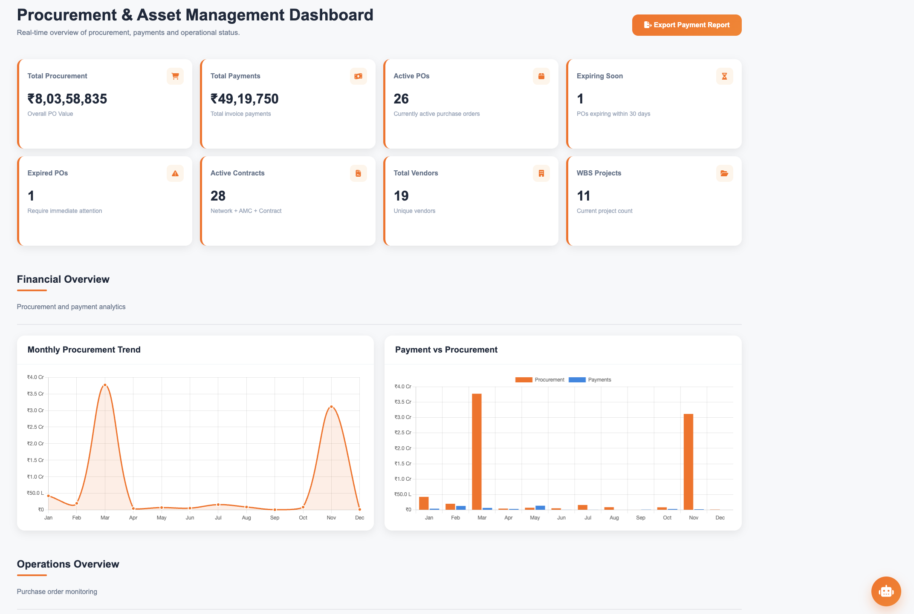
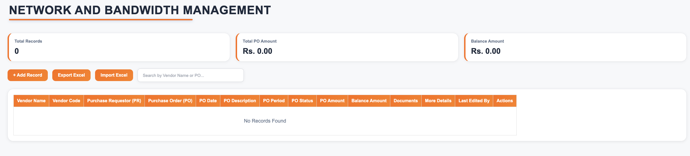
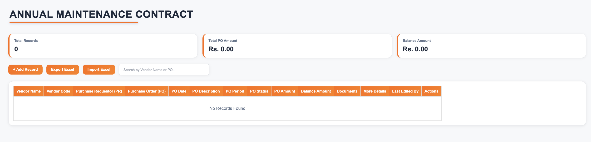
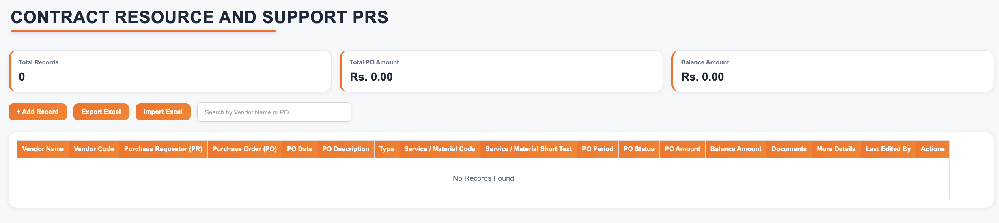
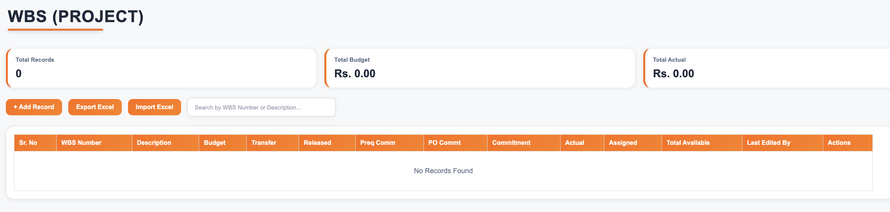

# 🚀 Procurement & Asset Management System

> A comprehensive Full-Stack Procurement & Asset Management System developed using **Node.js**, **Express.js**, **MongoDB**, **HTML**, **CSS**, and **JavaScript** to digitize procurement operations, inventory tracking, plant management, and project budget monitoring.

---


---

# 📌 Overview

The Procurement & Asset Management System is a centralized enterprise web application that streamlines procurement workflows, contract management, inventory tracking, plant operations, and project budget management.

The application eliminates manual record keeping by providing role-based access, secure authentication, Excel import/export, document management, dashboard analytics, and complete CRUD operations.

---

# ✨ Features

## 🔐 Authentication & User Management

- Secure Login

- Password Encryption
- Role-Based Access Control
- Dynamic Permission Management
- User Profile Management
- Change Password
- Email Notifications

---

## 📦 Procurement Management

- Network & Bandwidth Management
- Annual Maintenance Contracts (AMC)
- Contract Resource & Support PRs
- Purchase Order Tracking
- Invoice Tracking
- Balance Amount Calculation
- Document Upload (PDF)
- Excel Import
- Excel Export

---

## 🖥 IT Inventory

- Network Inventory
- Hardware Inventory
- Department Inventory

---

## 🏭 Plant Management

- Plant Material Records
- Plant Service Records

---

## 📊 WBS Project Management

- Project Budget
- Expense Tracking
- Remaining Budget Calculation

---

## ⚙ Additional Features

- Dashboard Analytics
- Charts
- Search
- Filter
- CRUD Operations
- Toast Notifications
- Confirmation Dialogs
- File Upload
- Responsive Dashboard Layout

---

# 🛠 Tech Stack

## Frontend

- HTML5
- CSS3
- JavaScript (ES6)

## Backend

- Node.js
- Express.js

## Database

- MongoDB
- Mongoose

## Libraries

- Multer
- XLSX
- bcryptjs
- Nodemailer
- dotenv
- CORS
- Chart.js

---

# 🏗 System Architecture

```
                User
                  │
                  ▼
      HTML • CSS • JavaScript
                  │
             REST APIs
                  │
                  ▼
        Node.js + Express.js
                  │
             Mongoose ODM
                  │
                  ▼
             MongoDB Atlas
```

---

# 📂 Project Structure

```
JSL-PROJECT
│
├── BACKEND
│   ├── config
│   ├── models
│   ├── routes
│   ├── services
│   ├── templates
│   ├── server.js
│   └── package.json
│
├── FRONTEND
│   ├── HTML
│   ├── CSS
│   ├── JavaScript
│   ├── Images
│   └── Assets
│
└── README.md
```

---

# 📸 Screenshots

## Login Page


---

## Dashboard



---

## Network Management



---

## AMC Management



---

## Contract Management



---

## Inventory


---

## Plant Management


---

## WBS Project



---

# ⚙ Installation

## Clone Repository

```bash
git clone https://github.com/yashkumar1907/Procurement-Asset-Management-System.git
```

## Backend

```bash
cd BACKEND
npm install
```

Create a `.env` file.

```env
PORT=5000

MONGO_URI=your_mongodb_connection_string

EMAIL_USER=your_email

EMAIL_PASS=your_app_password
```

Run backend

```bash
npm start
```

Open **login.html** from the FRONTEND folder.

---

# 📋 Main Modules

- Authentication
- Dashboard
- Network & Bandwidth Management
- Annual Maintenance Contract
- Contract Resource & Support PRs
- IT Inventory
- Plant Material
- Plant Service
- WBS Project Management

---

# 🚀 Future Enhancements

- Forgot Password
- Email Verification
- Mobile Responsive Design
- ERP Integration
- Audit Logs
- Advanced Analytics
- Multi-Organization Support

---

# 👨‍💻 Author

**Yash Kumar**

GitHub:
https://github.com/yashkumar1907

---

# 📄 License

This project is intended for educational and portfolio purposes.